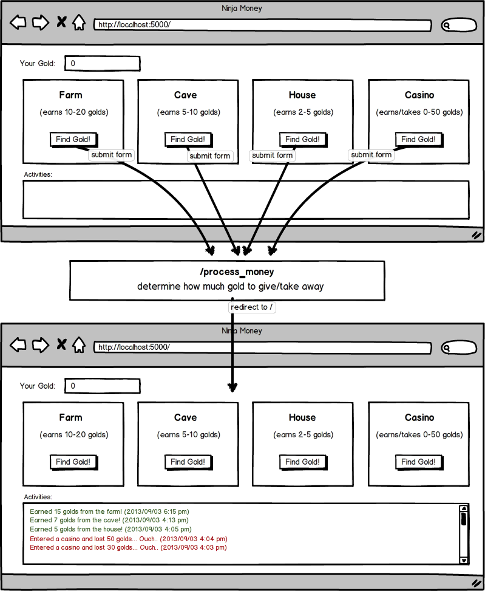
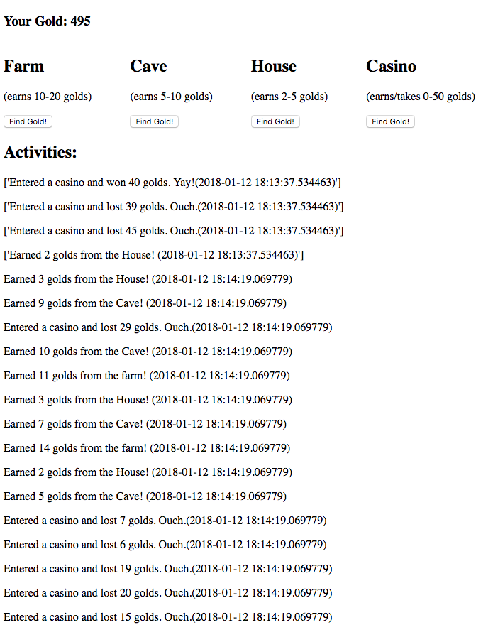

# Ninja Gold

Create a simple game to test your understanding of flask, and implement the functionality below.

For this assignment, you're going to create a mini-game that helps a ninja make some money! When you start the game, your ninja should have 0 gold. The ninja can go to different places (farm, cave, house, casino) and earn different amounts of gold. In the case of a casino, your ninja can earn or LOSE up to 50 golds. Your job is to create a web app that allows this ninja to earn gold and to display past activities of this ninja.

My Finished Assignment:

